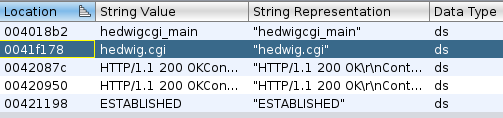
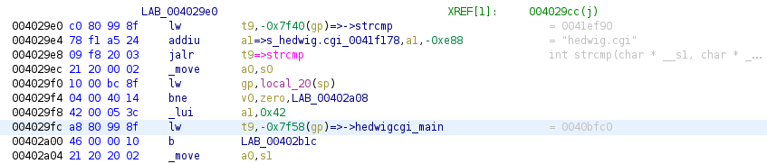
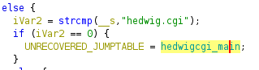
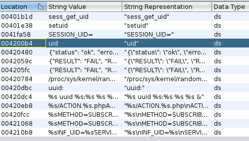
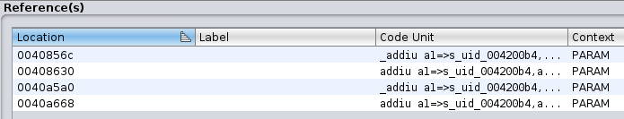

# Analyzing a buffer overflow in the DLINK DIR-645 with Qiling framework, Part I

## Introduction

Over the last couple of weeks I've been playing with a super interesting project: [Qiling Framework](https://www.qiling.io/) --- I highly recommend you to give it a try. 

I attended the virtual workshop given by xwings ---one of the creators --- at he [HITB conference](https://conference.hitb.org/hitb-lockdown002/virtual-labs/virtual-lab-qiling-framework-learn-how-to-build-a-fuzzer-based-on-a-1day-bug/) (amazing conference, by the way, with tons of content for free, thanks to the organization for that!). As I think that the best way to learn is by doing, I wanted to do some practice with this framework.

This blogpost is based on what I learned in the workshop. 

## Objective

My goal was to understand, reproduce and exploit one of the vulnerabilities reported by Roberto Paleari in 2013 (CVE-2013-7389). Now a 7-year-old vulnerability :P, affecting multiple DLINK routers, using Qiling and free tools. You can find the advisory [here](http://roberto.greyhats.it/advisories/20130801-dlink-dir645.txt).

I'll be focusing on the _Buffer overflow on "hedwig.cgi"_. For people familiar with MIPS and vulnerability analysis this will be very basic, but as I don't know almost anything about MIPS this was interesting and I've learned a lot. I hope you enjoy it.

## Overall idea

My first step was to determine at high level what I wanted to acomplish, the final list was:

1. Understand the vulnerability.
2. Reproduce it.
3. Identify the patch in the released firmware using Ghidra to perform patch diffing.
4. Write an exploit for it while running the binary in Qiling (Available exploits work with the hardware or with Qemu)
5. Improve and learn how to use Free RE tools.

Let's start with the first objective.

### Understanding the vulnerability

Based on the advisory I had an overall idea about what to look for and a simple way to trigger the bug. Unfortunately, the  advisory did not provide further details of the binary affected nor the underlying cause of the buffer overflow.

With the information provided regarding the affected Firmware version, I looked up on Google and found the following [link](http://ftp.dlink.ru/pub/Router/DIR-645/Firmware/) to download the vulnerable firmware.

Once downloaded, I used [binwalk](https://github.com/ReFirmLabs/binwalk) to decompress it.

With the firmware decompressed, I rushed to load in Ghidra a binary called *httpd* located in the *sbin* directory. I lost some time looking there without any clue on where the bug could be.

_Note: My tought process to conclude that the affected binary was that one was: The bug is located in the binary accepting HTTP connections, let's look it._

I read the advisory again and looked for some binary called \*hedwig\*cgi

```
$ find . -name *hedwig*cgi
./htdocs/web/hedwig.cgi

$ ls -larth ./htdocs/web/hedwig.cgi
lrwxrwxrwx ./htdocs/web/hedwig.cgi -> /htdocs/cgibin
```

As you can see there is a symlink called *hedwig.cgi* that points to the binary called *cgibin*. Let's analyze that one!.

I loaded the binary in Ghidra and looked for the "hedwig.cgi" string:



I checked where the string was used and landed here: (main function)



taking a look at the decompiled code:



As you can see the binary takes a string and compares it against our string of interest, if they are equal, function **hedwigcgi_main** will be called. It took me some time to make this work as I thought that the string was taken as a parameter when calling the cgibin binary, but the string is taken from the name of the binary itself which then, makes sense to have a symlink with the name **hedwig.cgi**. To fix that I've created the same symlink in the *htdocs* directory:

```
squashfs-root/htdocs$ ls -larth hedwig.cgi
hedwig.cgi -> cgibin
```

At the beggining I just quickly fixed this using Qiling's hooking address capabilities, redirecting program flow from the first instruction to the function I was interested in. Something like this:

```Python
MAIN_ADDR = 0x0402770
HEDWIGCGI_MAIN = 0x0040bfc0

def redirect_to_hedwigcgi_main(ql):
    ql.reg.arch_pc = HEDWIGCGI_MAIN
    return

...
ql = Qiling(path, rootfs, output = "debug", env=required_env)
ql.hook_address(redirect_to_hedwigcgi_main, MAIN_ADDR)
...
```

#### Finding the vulnerability in hedwingcgi_main function

Once I've identified the vulnerable function I analyzed it taking into account the PoC provided by the researcher and the exploit available in [metasploit](https://github.com/rapid7/metasploit-framework/blob/master//modules/exploits/linux/http/dlink_hedwig_cgi_bof.rb). Both of them trigger the vulnerability in (more or less) the same way, this means, with the following HTTP request:

```
...
POST /hedwig.cgi
cookie: uid=(PAYLOAD)
...
```
based on that I've did a quick search for the "uid" string as my guess was that there was some problem when parsing it:



I've checked where it is referenced:



The first and second references are inside a function called **sess_get_uid**, the last two are in a function that does not have symbols. I decided to focus in **sess_get_uid**, and check if this function was called from **hedwigcgi_main**.
Another interesting option is to confirm that we are reaching these functions emulating the binary with Qiling. This is easy:

```Python
import sys
sys.path.append("..")
from qiling import *

MAIN = 0x0402770
HEDWIGCGI_MAIN_ADDR = 0x0040bfc0
SESS_GET_UID = 0x004083f0

def my_sandbox(path, rootfs):
    ql = Qiling(path, rootfs, output = "none")
    ql.add_fs_mapper('/tmp', '/var/tmp')        # Maps hosts /tmp to /var/tmp
    ql.hook_address(lambda ql: ql.nprint("** At [main] **"), MAIN)
    ql.hook_address(lambda ql: ql.nprint("** At [hedwigcgi_main] **"), HEDWIGCGI_MAIN_ADDR)
    ql.hook_address(lambda ql: ql.nprint("** At [sess_get_uid] **"), SESS_GET_UID)
    ql.run()

if __name__ == "__main__":
    my_sandbox(["_DIR645A1_FW103RUB08.bin.extracted/squashfs-root/htdocs/hedwig.cgi"], "_DIR645A1_FW103RUB08.bin.extracted/squashfs-root")

```

And the output (just the important part):

```
...
mprotect(0x77569000, 0x1000, 0x1) = 0
mprotect(0x47ce000, 0x1000, 0x1) = 0
ioctl(0x0, 0x540d, 0x7ff3ca30) = -1
ioctl(0x1, 0x540d, 0x7ff3ca30) = -1
** At [main] **
** At [hedwingcgi_main] **
write(1,7756d038,112) = 0
HTTP/1.1 200 OK
Content-Type: text/xml
...
```

We can see that the execution reached _main_ and _hedwigcgi_main_ but not (yet) _session_get_uid_. Let's take a look and find what we need to reach this function.

```C
...
  http_request_method = getenv("REQUEST_METHOD");
  if (http_request_method == (char *)0x0) {
    http_request_method = "no REQUEST";
  } else {
    is_http_POST = strcasecmp(http_request_method, "POST");
    if (is_http_POST != 0) {
      http_request_method = "unsupported HTTP request";
      goto invalid_http_method;
    }
...
```

Looking at the decompiled code generated by Ghidra (I was totally surprised about its quality, it's almost valid C code, I've just renamed some variables to make the code more readable) we can see that very early on function hedwigcgi_main, there is a check that looks for the value of an  environment variable called **REQUEST_METHOD**. If that variable doesn't contain the value **POST** (second IF clause), we'll never reach our desired function.

_Note: I've assumed that in the real hardware, for some reason these environment variables are already populated by  someone else and did not bother in checking who was doing it._

Using [Qiling](https://docs.qiling.io/en/latest/howto/) magic it's easy to set environment variables:

```Python
...
required_env = {
        "REQUEST_METHOD": "POST",
    }

ql = Qiling(path, rootfs, output = "none", env=required_env)
...
```

We just need to pass a dictionary where keys are the variables names and values... its values.

Let's try running the binary again, but this time with our fake environment:

```
...
mprotect(0x77569000, 0x1000, 0x1) = 0
mprotect(0x47ce000, 0x1000, 0x1) = 0
ioctl(0x0, 0x540d, 0x7ff3ca08) = -1
ioctl(0x1, 0x540d, 0x7ff3ca08) = -1
** At [main] **
** At [hedwingcgi_main] **
brk(0x0)
brk(0x438000)
open(/etc/config/image_sign, 0x0, 0o0) = 3
ioctl(0x3, 0x540d, 0x7ff3c818) = -1
brk(0x439000)
read(3, 0x437098, 0x1000) = 27
close(3) = 0
** At [sess_get_uid] **
socket(1, 1, 0) = 3
fcntl(3, 2) = 0
...
```

Good! now we are reaching our point of interest. After taking a look at the function and also checking the advisory I guessed that this function checked the value of the HTTP COOKIE header (again, reading an env. variable).

```C
cookie_value = getenv("HTTP_COOKIE");
```

and searched for the "uid" string, once found, it processed what came next to it. I guess the function accounted for mutiple values inside the cookie header, something like this:

```
Cookie: Avalue=123;OtherVal=AAA;uid=TEST
```

Taking a look at the exploit we can see that sending an HTTP requests with a Cookie header containing **uid=(enough_data)** will be sufficient to trigger the exploit. So we are in the right place.

Let's trigger the bug. For this, we will need to set the **HTTP_COOKIE** environment variable:

```Python
...
buffer = "uid=%s" % (b"A" * 1041 + b"1111")
required_env = {
    "REQUEST_METHOD": "POST",
    "HTTP_COOKIE"   : buffer
}
...
```

This is the output after running our script. I've ommited parts of it for clarity:

```
...
** At [main] **
** At [hedwingcgi_main] **
** At [sess_get_uid] **
[!] Emulation Error

[-] s0	:	 0x41414141
[-] s1	:	 0x41414141
[-] s2	:	 0x41414141
[-] s3	:	 0x41414141
[-] s4	:	 0x41414141
[-] s5	:	 0x41414141
[-] s6	:	 0x41414141
[-] s7	:	 0x41414141
[-] t8	:	 0x8
[-] t9	:	 0x0
[-] k0	:	 0x0
[-] k1	:	 0x0
[-] gp	:	 0x43b6d0
[-] sp	:	 0x7ff3c608
[-] s8	:	 0x41414141
[-] ra	:	 0x41414141
[-] status	:	 0x0
[-] lo	:	 0x0
[-] hi	:	 0x0
[-] badvaddr	:	 0x0
[-] cause	:	 0x0
[-] pc	:	 0x41414140
[-] cp0_config3	:	 0x0
[-] cp0_userlocal	:	 0x0

[+] PC = 0x41414140
[+] Start      End        Perm.  Path
unicorn.unicorn.UcError: Invalid memory read (UC_ERR_READ_UNMAPPED)
```

As it's possible to see, we are triggering the bug!, looks like that the function is parsing our input and in some way mishandles it ending up copying it to a place where it does not fit and overwrites registers values previously saved. Let's confirm this. Now, that we have a clear idea where the bug is happening, let's find the exact place. To acomplish this I've tried different ideas:

0) Debug!. It's possible to debug the binary using GDB. I did have some issues when I first tried to make this idea work and I opened an [issue](https://github.com/qilingframework/qiling/issues/415) and promply had an answer that worked. We'll use this alternative along with option 2. To debug we just need to do the following:

```Python
...
ql.debugger = True
...
```

```
$ python emulate_hedwigcgi.py

debugger> Initializing load_address 0x0
debugger> Listening on 127.0.0.1:9999
```

To debug we'll need GDB multiarch. To install it we execute:

```
sudo apt-get install gdb-multiarch

```

And to attach to Qiling:

```
$ gdb-multiarch
(gdb) set remotetimeout 100
(gdb) target remote 127.0.0.1:9999

Remote debugging using 127.0.0.1:9999
warning: while parsing target description: no element found
warning: Could not load XML target description; ignoring
warning: while parsing target description: no element found
warning: Could not load XML target description; ignoring
Reading /lib/ld-uClibc.so.0 from remote target...
warning: Unable to find dynamic linker breakpoint function.
GDB will be unable to debug shared library initializers
and track explicitly loaded dynamic code.
0x004025c0 in _ftext ()
```

1) Print every instruction until the exception is raised, this is easy to do with Qiling. We'll define a callback function that will print every instruction that's executed. We'll hook this callback to the beggining of **sess_get_uid**.

```Python
...
# From https://github.com/qilingframework/qiling/blob/master/examples/hello_x8664_linux_disasm.py

def print_asm(ql, address, size):
    buf = ql.mem.read(address, size)
    for i in md.disasm(buf, address):
        print(":: 0x%x:\t%s\t%s" %(i.address, i.mnemonic, i.op_str))

####
...

def  hook_sess_get_uid(ql):
    ql.hook_code(print_asm)

ql.hook_address(hook_sess_get_uid, SESS_GET_UID)

```
This option did not work as there is plenty of code executed and did not help identifying the exact place where the out of bounds write happened. Also it could happen that the memory corruption happens at place X and registers are overwrite at place Y (when executing the ret instruction).

2) Then I've moved to my second idea, I decided to check for the usage of potential insecure functions such as **strcpy**. [Again, this is straightforward with Qiling](https://docs.qiling.io/en/latest/hijack/#on-enter-interceptor-on-posix-function-with-qlset_api), we can hook functions and do whatever we want:

```Python
...
# Once strcpy is called we'll print the arguments and pass them to the real strcpy
def strcpy_hook(ql):
    print("dst: %s" % hex(ql.os.function_arg[0]))
    print("src: %s" % ql.mem.string(ql.os.function_arg[1]))

    #Not sure why I have to return 2 to continue with the call
    #to the strcpy function. This was taken from example:
    #hello_mips32el_linux_function_hook.py
    return 2

ql.set_api('strcpy', strcpy_hook, QL_INTERCEPT.ENTER)
...
```

Checking the results:

```
** At [sess_get_uid] **
dst: 0x437898
src: b'AAAAAAAAAAAAAAAAAA...AAA'
...
[+] PC = 0x41414140
```

Excellent, now we know where our buffer is being written (0x437898) and also that strcpy is somehow involved.

When I first found this I was very happy as I thougt that this strcpy was the root cause of the crash. But if you check the destination address, **0x437898**  it's in the heap address space:

```
...
[+] 00437000 - 00438000 - rwx    [brk]
...
```

Also if we take a look at where the strcpy is copying the data, we will find that at the beggining of the **sess_get_uid** function we have some calls to function **sobj_new**, that between other things it returns a pointer to a memory allocated with malloc (heap).

So, my question was if our destination address for the strcpy is **0x437898** and which is the heap, and the program is crashing because the Program Counter (PC) points to an invalid address... What's going on? Somehow the our overly long string has to end up overwriting something in the stack, but clearly that's not happening right after the strcpy. I had to debug this several hours to completely understand what was happening.

The answer is that at address **0x0040c1c0** there is a call to **sprintf**. This function receives as parameters three strings as we can see in the following snippet:

```
0040c1b4 21 38 40 00     move       a3,v0
0040c1b8 21 30 40 02     move       a2=>s_/runtime/session_00420140,s2               = "/runtime/session"
0040c1bc 2c 08 a5 24     addiu      a1=>s_%s/%s/postxml_0042082c,a1,0x82c            = "%s/%s/postxml"

```

register $a3 points to our buffer:

```
gef➤  x/s $a3
0x437898:	"b'", 'A' <repeats 2000 times>, "'"
```

sprintf will format the string passed as arguments using the format specified and our buffer, what's more important is that, the destination is a local variable IN THE STACK!:

```
gef➤  x/s $s1
0x7ff3c1e0:	"/runtime/session/b'", 'A' <repeats 2000 times>, "'/postxml"
```

So our puzzle is complete. Summarizing:

1. We send an HTTP POST request containing a COOKIE header.
2. the header must contain a uid=(BUFFER) string.
3. A strcpy will copy (BUFFER) to the heap without checking for size.
4. a sprintf will use our input as part of some string formating storing the result in a variable stored in the stack. If our buffer is large enough it will end up overwriting previously saved registers, including the return address.

 To confirm the last point, I've set up a breakpoint in the return instruction of function **hedwigcgi_main**:

```
Breakpoint 1, 0x0040c594 in hedwigcgi_main ()

...
$s0  : 0x41414141 ("AAAA"?)
$s1  : 0x41414141 ("AAAA"?)
$s2  : 0x41414141 ("AAAA"?)
$s3  : 0x41414141 ("AAAA"?)
$s4  : 0x41414141 ("AAAA"?)
$s5  : 0x41414141 ("AAAA"?)
$s6  : 0x41414141 ("AAAA"?)
$s7  : 0x41414141 ("AAAA"?)
$t8  : 0x8       
$t9  : 0x0       
$k0  : 0x0       
$k1  : 0x0       
$s8  : 0x41414141 ("AAAA"?)
$pc  : 0x0040c594
$sp  : 0x7ff3c120
$hi  : 0x0       
$lo  : 0x0       
$fir : 0x0       
$ra  : 0x41414141 ("AAAA"?)
...

→   0x40c594 <hedwigcgi_main+1492> jr     ra
```

It's clear that the sprintf copied our buffer and overwrote the previously saved registers with our input. From here it should be easy to gaing reliable code execution as we can control the $PC.

## Conclusion

Finally! we have resolve the puzzle. It took me great effort to join the pieces and fully understand what was happening between the strcpy and the actual crash. I hope that you enjoyed the blogpost and found it useful!.

I've uploaded the Python script that I've been using during the blogpost as a reference. You can find it [here]().

In the next part of this series, I'll continue working on how to write an exploit that works in Qiling!.

Stay tuned.


# References

Original advisory: https://web.archive.org/web/20140418120534/http://securityadvisories.dlink.com/security/publication.aspx?name=SAP10008

MIPS subrutines/Functions: https://people.cs.pitt.edu/~xujie/cs447/Mips/sub.html

Slides from the training given by Qiling team in HITB: https://conference.hitb.org/hitblockdown002/materials/D1%20VIRTUAL%20LAB%20-%20Qiling%20Framework%20-%20Kaijern%20Lau.pdf
